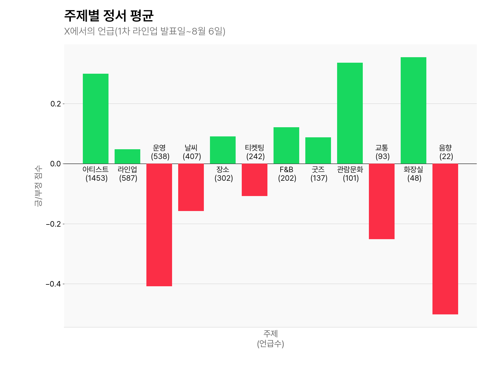
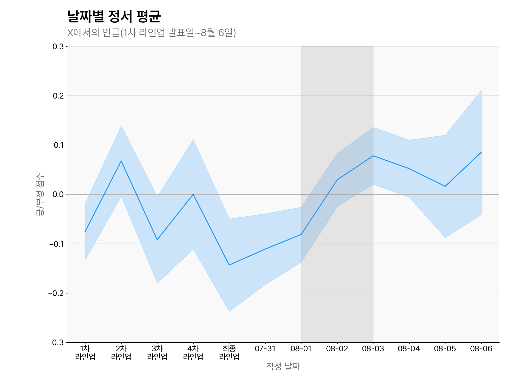

### [아티클 참조](https://lab-chasm.vercel.app/article/15)

  
  

### `Xscrape.ipynb`
- X(트위터) 데이터 **크롤링**을 위한 노트북.  
- 코드 내에 X 계정 **ID / PASSWORD**를 직접 입력해야 함.

### `언급분석.ipynb`
- 크롤링된 데이터를 바탕으로 **긍정/부정 정서 분석**을 수행.  
- 날짜별 및 주제별 정서 양상을 분석.

> `언급분석.ipynb` 실행 시 필요한 GPT API 관련 파일:
> - `GPT_1.py`: 펜타포트 **관련/비관련 언급**을 GPT API로 태깅  
> - `GPT_2.py`: 언급된 **주제**를 GPT API로 태깅  
>
> GPT API 사용 방법:
> 1. `OPENAI_API_KEY`를 `.txt` 파일에 저장  
> 2. 해당 파일 이름을 `.env`로 변경  
> 3. `GPT_1.py`, `GPT_2.py`에서 `.env`를 통해 API 키 자동 로드

